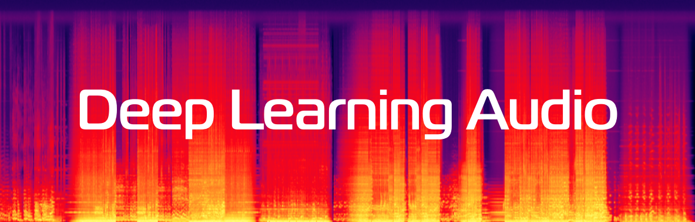

# Deep Learning for Audio Course, 2026

## Description
Topics discussed in course:
- Digital Signal Processing
- Automatic Speech Recognition (ASR)
- Key-word spotting (KWS)
- Text-to-Speech (TTS)
- Voice Conversion
- Self supervised learning in Audio
- Codec models
- LLM-based Audio Generation
- Music & Audio Generation
- Speaker verification

## Course materials
## Materials

| # | Date         | Description                                                                                 | Slides                                        |
|---------|--------------|---------------------------------------------------------------------------------------------|-----------------------------------------------|
| 1 | <b>Lecture:</b> | Introduction and Digital Signal Processing | [slides](lectures/lecture01_DLAudio2026.pdf)  |
|  | <b>Seminar:</b> | Introduction and Spectrograms, Griffin-Lim Algorithm | [notebook](seminars/seminar01/seminar1.ipynb) |
| 2 | <b>Lecture:</b> | Automatic Speech Recognition 1: WER, Datasets, CTC, LAS | [slides](lectures/lecture02_DLAudio2026.pdf) |
|  | <b>Seminar:</b> | WER, Levenstein distance, CTC | [notebook](seminars/seminar02/seminar2.ipynb) |
| 3 | <b>Lecture:</b> | Automatic Speech Recognition 2: RNN-T, Language models in ASR, BPE, Whisper | [slides](lectures/lecture03_DLAudio2026.pdf)  |
|  | <b>Seminar:</b> | Automatic Speech Recognition 2: RNN-T, Whisper                              | [notebook](seminars/seminar03)                |
| 4 | <b>Lecture:</b> | Key-word spotting (KWS) | [slides](lectures/lecture04_DLAudio2026.pdf)  |
|   | <b>Seminar:</b> | Key-word spotting | [notebook](seminars/seminar04/seminar4.ipynb) |
| 5 | <b>Lecture:</b> | Automatic Speech Recognition 3: Self-supervised learning in Audio (Wav2Vec2.0, GigaAM, HuBERT, BEST-RQ) | [slides](lectures/lecture05_DLAudio2026.pdf)  |
|  | <b>Seminar:</b> | Automatic Speech Recognition 3: Wav2Vec2.0 | [notebook](seminars/seminar05/wav2vec2.ipynb) |
| 6 | <b>Lecture:</b> | Speaker verification and identification | [slides](lectures/lecture06_DLAudio2026.pdf)  |
|   | <b>Seminar:</b> | Speaker verification, Angular Softmax, Margin Softmax   | [notebook](seminars/seminar06/seminar6.ipynb) |
| 7 | <b>Lecture:</b> | Text-to-speech 1: WaveNet, Tacotron2, FastSpeech, Guided Attention, Neural Vocoders (PW-GAN, Hi-Fi GAN) | [slides](lectures/lecture07_DLAudio2026.pdf)  |
|   | <b>Seminar:</b> | Text-to-speech 1: WaveNet, Tacotron2 | [notebook](seminars/seminar07/seminar7.ipynb) |
| 8 | <b>Lecture:</b> | Text-to-speech 2: Flow-based models (Glow-TTS, VITS), diffusion TTS (DiffWave, Grad-TTS), Conditional Flow Matching (Voicebox, E2-TTS, F5-TTS)| [slides](lectures/lecture08_DLAudio2026.pdf)  |
|   | <b>Seminar:</b>  | HiFi-GAN | [notebook](seminars/seminar08/seminar8.ipynb) |
| 9 | <b>Lecture:</b> | Voice Conversion: CycleGAN-VC, StarGAN-VC, AutoVC, Seed-VC, Singing Voice Conversion | [slides](lectures/lecture09_DLAudio2026.pdf)  |
|   | <b>Seminar:</b> |  | [notebook](seminars/seminar09/seminar.ipynb)  |
| 10 | <b>Lecture:</b> | Text-to-speech 3: Codec Models (RVQ, SoundStream, Encodec, Mimi), VQ-VAE, VALL-E, TortoiseTTS, NaturalSpeech, CozyVoice, FishSpeech | [slides](lectures/lecture10_DLAudio2026.pdf)  |
|    | <b>Seminar:</b> | Encodec, Soundstream, Residual Vector Quantization | [notebook](seminars/seminar10/seminar.ipynb)  |
| 11 | <b>Lecture:</b> | LLM-based audio models: SEED-ASR, Llama3, Phi4, SpeechGPT, Mini-Omni, Llama-Omni, Moshi | [slides](lectures/lecture11_DLAudio2026.pdf)  |
|    | <b>Seminar:</b> | VITS, Normalizing flows | [notebook](seminars/seminar11/seminar.ipynb)  |
| 12 | <b>Lecture:</b> | Audio & Music Generation: Jukebox, Diffusion models (Diffsound, Riffusion, Noise2Music), AudioLM & MusicLM, AudioGen & MusicGen, MeLoDy, YuE, Music Agents | [slides](lectures/lecture12_DLAudio2026.pdf)  |
|    | <b>Seminar:</b> | |   |
| TBD | <b>Lecture:</b> | FishSpeech, XTTS, SpearTTS, MQTTS |  |

## Homeworks
| Homework | Date | Deadline | Description | Link |
|---------|------|-------------|--------|-------|
| 1 (2 points) | February, 4 | February, 18 (23:59) | <ol><li>Audio classification</li><li>Audio preprocessing</li></ol> |  |
| 2 (2 points) | February, 17 | March, 4 (23:59) | ASR-1: CTC |   |
| 3 (2 points) | March, 6 | March, 22 (23:59) | ASR-2: RNN-T |   |
| 4 (2 points) | March, 24 | April, 6 (23:59) | Speaker Verification |   |
| 5 (2 points) | April, 5 | April, 19 (23:59) | Text-to-speech: FastPitch |   |

## Game rules
- 5 homeworks each of 2 points = **10 points**
- final test = **1 point**
- Bonus points in HWs
- maximum points: 10 (hws) + 1 (test) + (bonus points in hws) = **11 points** + **bonus points**

## Authors

Pavel Severilov
- **telegram:** [@severilov](https://t.me/severilov)
- **e-mail:** pseverilov@gmail.com
- **BIO:** 
  - Education: MIPT
  - Experience: AI-assistants (NLP, ASR, OCR), signals (Samokat+Kuper, Domclick, Dbrain, Gazpromneft, MIL-team)
  - Lecturer: AI Masters, MIPT, ex-Deep Learning School

Daniel Knyazev
- **telegram:** [@daniel_knyazev](https://t.me/daniel_knyazev)
- **e-mail:** xmaximuskn@gmail.com
- **BIO:** 
  - Education: MIPT
  - Experience: xlabs-ai, Sberdevices

Roman Vlasov
- **telegram:** [@roman_studentin](https://t.me/roman_studentin)
- **e-mail:** vlasovroman2017@gmail.com
- **BIO:** 
  - Education: MIPT, AI Masters
  - Experience: Computer Vision (Yandex), LLM NLP & TTS (SberDevices), LLM in e2e speech understanding+synthesis
